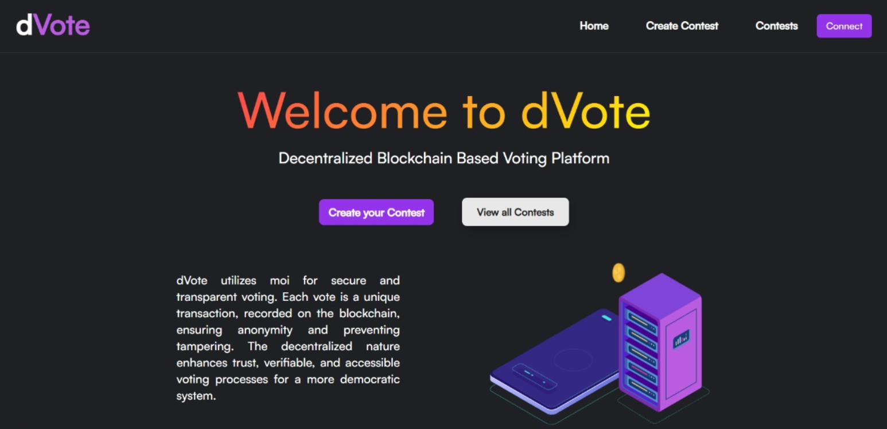

# Contest Voting System using MOI Token



## Overview

The Contest Voting System using MOI Token is a decentralized application designed to facilitate fair and transparent voting in various contests. This system leverages the MOI Token, a blockchain-based digital asset, to ensure the integrity and security of the voting process.

## Features

1. **Decentralized Voting:** The system operates on a decentralized network, ensuring that no single entity has control over the entire voting process. This enhances the transparency and trustworthiness of the contests.

2. **MOI Token Integration:** MOI Token, a blockchain-based digital asset, is utilized for voting. This not only provides a secure and tamper-proof voting mechanism but also allows for easy tracking and auditing of votes.

3. **Smart Contracts:** Smart contracts are used to automate the execution of the voting process. This eliminates the need for intermediaries, reduces the risk of fraud, and ensures that the voting rules are enforced without bias.

4. **User Authentication:** Users can securely authenticate themselves using their MOI Tokens. This adds an additional layer of security to the system, preventing unauthorized access and ensuring that each vote is linked to a legitimate user.

5. **Contest Creation:** Organizers can easily create and manage contests through the user-friendly interface. They can specify the rules, duration, and other parameters for each contest.

6. **Real-time Results:** The system provides real-time updates on the voting results, allowing participants and organizers to track the progress of the contest. This transparency builds trust among the stakeholders.

## Getting Started

### Prerequisites

- **IOMI.AI Account:** Users need to have a iomi.ai to participate in the voting process. Ensure that you have a wallet set up.

### Installation

1. Clone the repository:
   ```bash
   git clone https://github.com/your-username/contest-voting-moi-token.git
2. Navigate to the project directory:
   ```bash
   cd contest-voting-moi-token
3. Install dependencies:
   ```bash
   npm install

## Usage
1. Configure Smart Contracts: Set up the smart contracts on the blockchain network of your choice. Update the contract addresses in the configuration file.

2. Run the Application: Execute the application using the command:
   ```bash
   npm start

3. Create Contests: Organizers can log in, create contests, and specify the details of each contest.

## Contributing

We welcome contributions from the community. If you have suggestions or would like to report issues, please create a GitHub issue or submit a pull request.

5. Vote: Participants can authenticate using their MOI Token wallet and cast their votes for their preferred entries.

6. View Results: Real-time results are available for both participants and organizers.
